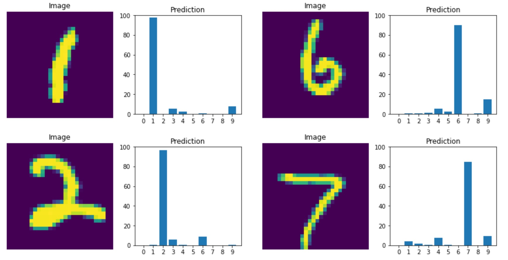

# My-Neural-Network
Building my own neural network package with unit tests.

In this project I want to practice writing python packages and unit testing. I am writing my own neural network package - no keras here!
I am including unit tests. The completed network is trained on the mnist handwritten dataset to test if it works. 

My Neural Network.ipynb contains demonstrations of the package in use. 
The 'jacobnet' directory contains the package itself and 'tests' contains the unit tests. 
To run the tests (requires pytest) from the My Neural Network directory: python -m pytest

(pipenv used for virtual environment management and pytest used for testing.)

Here you can see some predictions from the trained neural network. 
